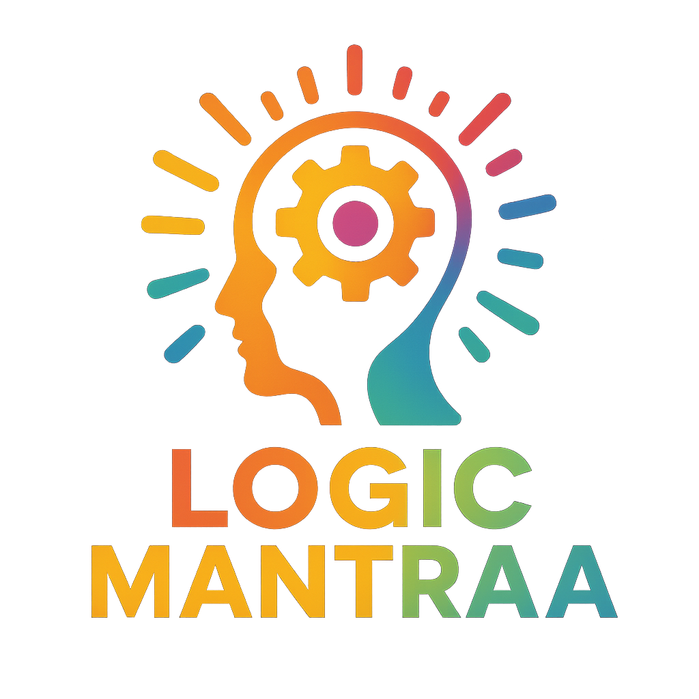

# Logic Mantraa - EdTech Learning Platform



A comprehensive MERN stack educational platform delivering interactive learning experiences for students and robust management tools for administrators.

## 🚀 Overview

Logic Mantraa is designed to streamline online education. It provides a seamless interface for students to discover courses, track progress, and engage with content, while offering administrators a powerful dashboard to manage the entire ecosystem.

## ✨ Key Features

### For Students
- **Course Discovery**: Advanced search and filtering by category, level, and price.
- **Interactive Learning**: YouTube-integrated video lectures and downloadable resources.
- **Progress Tracking**: Real-time completion tracking and personalized "My Courses" dashboard.
- **Engagement**: Course rating and review system with community feedback.
- **Integrated Store**: Access to supplementary educational materials.

### For Administrators
- **Analytics Dashboard**: Comprehensive platform statistics and engagement monitoring.
- **Content Management**: Intuitive tools for managing courses, lectures, and resources.
- **User Management**: Complete control over user accounts and registration.
- **Communication**: Centralized contact form management with intent categorization.

## 🛠️ Tech Stack

- **Frontend**: React 19, Vite, CSS Modules, React Router
- **Backend**: Node.js, Express.js
- **Database**: MongoDB with Mongoose
- **Auth**: JWT-based authentication
- **Storage**: Local file storage support

## 🏁 Quick Start

1. **Clone & Install**:
   ```bash
   git clone <repository-url>
   cd LogicMantraa
   npm run install-all # Assuming we add a root script, or just:
   # cd client && npm install && cd ../server && npm install
   ```

2. **Configure**:
   - Create `.env` files in both `client` and `server` directories.
   - See [SETUP_GUIDE.md](./SETUP_GUIDE.md) for detailed variable requirements.

3. **Run**:
   ```bash
   # Terminal 1 (Backend)
   cd server && npm run dev

   # Terminal 2 (Frontend)
   cd client && npm run dev
   ```

## 📖 Documentation

- [Setup Guide](./SETUP_GUIDE.md) - Detailed installation and configuration instructions.
- [API Reference](./docs/API.md) - (Coming Soon) Detailed API endpoint documentation.

## 🗺️ Roadmap

- [ ] Razorpay Payment Integration
- [ ] Discussion Forums & Live Sessions
- [ ] Mobile Application (React Native)

---

**Built with ❤️ by the Logic Mantraa Team**
